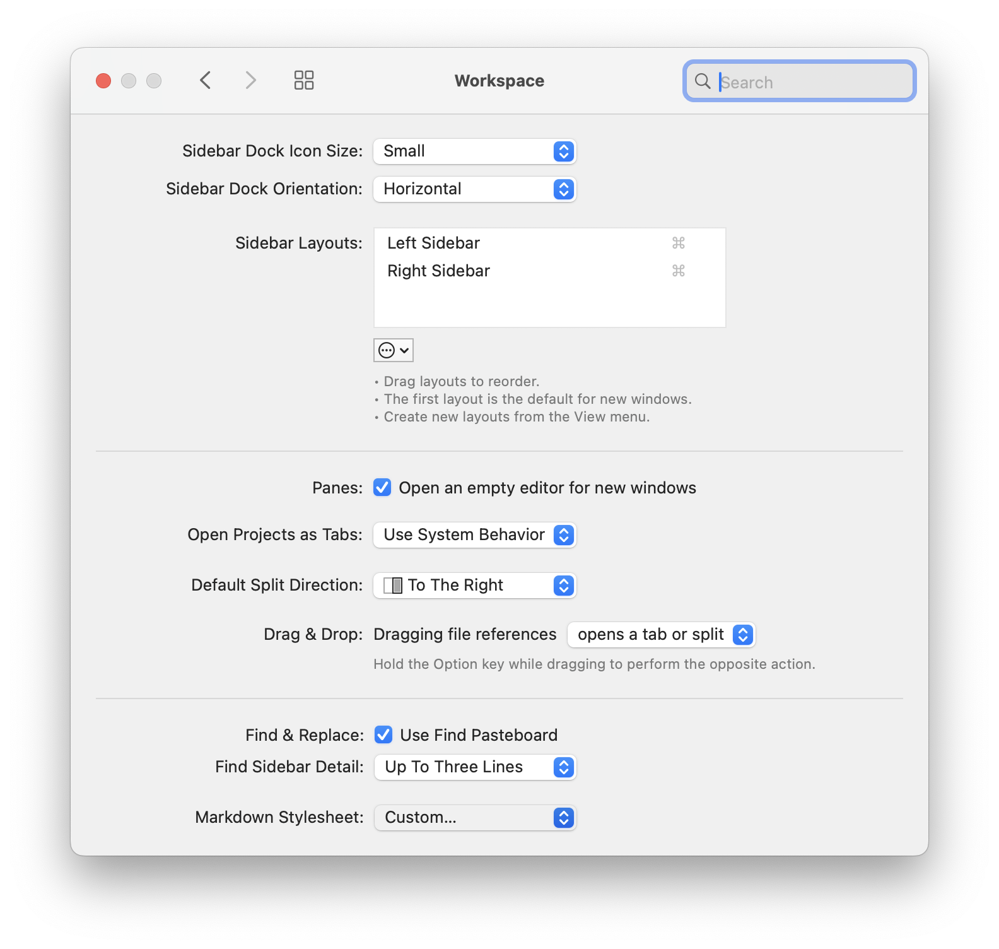

# GitHub Markdown CSS in Nova

Markdown stylesheets for [Nova.app](https://nova.app) based on [GitHub Flavored Markdown][gfm] style.

The CSS is generated. Contributions should go to this repository: \
[`andesco/generate-github-markdown-css`](https://github.com/andesco/generate-github-markdown-css)

## Markdown Stylesheets in Nova

1. Nova.app → Settings… → Workspace → Markdown Stylesheet: Custom…

<!----  ---->

<p align="center">
	<a href="nova-settings.png"></a>
</p>

2. Select a stylesheet:

   Auto: **`github-markdown-auto.css`** \
   Dark-only: **`github-markdown-dark.css`** \
   Light-only: **`github-markdown-light.css`**

   > Auto switches between light and dark modes using: \
    > [`@media (prefers-color-scheme)`][mozilla]
   
   <details><summary>other available themes<br />&nbsp;</summary>
   
   Dark Colorblind High Contrast: `github-markdown-dark_colorblind_high_contrascss` \
   Dark Colorblind: `github-markdown-dark_colorblind.css` \
   Dark Dimmed High Contrast: `github-markdown-dark_dimmed_high_contrast.css` \
   Dark Dimmed: `github-markdown-dark_dimmed.css` \
   Dark High Contrast: `github-markdown-dark_high_contrast.css` \
   Dark Tritanopia High Contrast: `github-markdown-dark_tritanopia_high_contrascss` \
   Dark Tritanopia: `github-markdown-dark_tritanopia.css` \
   Light Colorblind High Contrast: `github-markdown-light_colorblind_high_contrt.css` \
   Light Colorblind: `github-markdown-light_colorblind.css` \
   Light High Contrast: `github-markdown-light_high_contrast.css` \
   Light Tritanopia High Contrast: `github-markdown-light_tritanopia_high_contrt.css` \
   Light Tritanopia: `github-markdown-light_tritanopia.css`
   
   </details>


## Development

### `generate-github-markdown-css`

All stylesheets were generated by [`andesco/generate-github-markdown-css`](https://github.com/andesco/generate-github-markdown-css) using the optional `--include` flag which prepends `include.css` to define base styling and responsive padding:

   ```CSS include.css
   body {
     box-sizing: border-box;
     min-width: 200px;
     max-width: 980px;
	 margin: 0 auto;
	 padding: 45px;
   }
   @media (max-width: 767px) {
     body {
       padding: 15px;
     }
   }
   ```

Generate a `CSS` file for each possible theme and the `auto` default:

```
for THEME in $(github-markdown-css --list) auto; do
  github-markdown-css --$THEME=$THEME --root-selector=body --include > github-markdown-$THEME.css
done
```

### `transform_css.py`

This Python script modifies the `CSS` from [`sindresorhus/github-markdown-css`](https://github.com/sindresorhus/github-markdown-css) to generate new stylesheets for [Nova.app][nova] and other HTML-rendered Markdown.

The script can process all `.css` files in the current directory and overwrite exisiting files:
```
python3 transform_css.py --replace
```

The script makes the following changes:

1.  replaces all instances of `.markdown-body␣{` with `body␣{`
2.  removes al all instances of `.markdown-body␣`
3.  replaces all instances of `.markdown-body,` with `body,`
4.	removes any remaining `CSS` rules that matches this regex: \
`^\s*\.markdown-body[^{]*\{[^}]*\}`
5. inserts this `CSS` block at the beginning of each new file to define base styling and responsive padding:

   ```CSS
   body {
     box-sizing: border-box;
     min-width: 200px;
     max-width: 980px;
    margin: 0 auto;
    padding: 45px;
   }
   @media (max-width: 767px) {
     body {
       padding: 15px;
     }
   }
   ```

[gfm]: https://docs.github.com/en/get-started/writing-on-github/getting-started-with-writing-and-formatting-on-github/basic-writing-and-formatting-syntax
[mozilla]: https://developer.mozilla.org/docs/Web/CSS/@media/prefers-color-scheme
