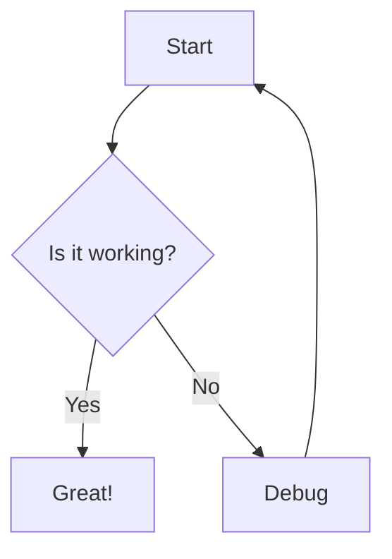

# GitHub Markdown CSS: <br />User Stylesheets for Nova

These Markdown stylesheets bring the style of [GitHub Flavored Markdown][gfm] on `github.com` to Markdown previews in [Nova.app](https://nova.app) — and any app that accepts [user stylesheets][mozilla-user].

Preview exactly how your Markdown and `readme.md` files will look on GitHub while writing in Nova or your favourite app.

## Markdown Stylesheets for Nova

1. Nova.app → Settings… → Workspace → Markdown Stylesheet: Custom…

<!----  ---->

<p align="center">
	<a href="nova-settings.png"></a>
</p>

2. Select a stylesheet:

    Auto: **`github-markdown-auto.css`** \
    Dark only: **`github-markdown-dark.css`** \
    Light only: **`github-markdown-light.css`**
    
    <details>
      <summary>other available themes
      <br />&nbsp;
    </summary>
      Dark Colorblind High Contrast: `github-markdown-dark_colorblind_high_contrascss` <br />
      Dark Colorblind: `github-markdown-dark_colorblind.css` <br />
      Dark Dimmed High Contrast: `github-markdown-dark_dimmed_high_contrast.css` <br />
      Dark Dimmed: `github-markdown-dark_dimmed.css` <br />
      Dark High Contrast: `github-markdown-dark_high_contrast.css` <br />
      Dark Tritanopia High Contrast: `github-markdown-dark_tritanopia_high_contrascss` <br />
      Dark Tritanopia: `github-markdown-dark_tritanopia.css` <br />
      Light Colorblind High Contrast: `github-markdown-light_colorblind_high_contrt.css` <br />
      Light Colorblind: `github-markdown-light_colorblind.css` <br />
      Light High Contrast: `github-markdown-light_high_contrast.css` <br />
      Light Tritanopia High Contrast: `github-markdown-light_tritanopia_high_contrt.css` <br />
      Light Tritanopia: `github-markdown-light_tritanopia.css`
    </details>

## GitHub Markdown Extensions for Nova

The included Swift script extends Nova's Markdown preview with three powerful features:

1. **GitHub Markdown Alerts** - Distinctive colored callouts with icons
2. **Syntax Highlighting** - Beautiful code highlighting using highlight.js
3. **Mermaid Diagrams** - Render flowcharts, sequence diagrams, and more

### Installation

The script downloads necessary JavaScript libraries and patches Nova's preview runtime:

```bash
sudo swift nova-markdown-extensions.swift install   # install all extensions (requires sudo)
swift nova-markdown-extensions.swift status         # check installation status
swift nova-markdown-extensions.swift update         # update libraries without re-patching
sudo swift nova-markdown-extensions.swift restore   # restore original files from backups
```

**Note:** After installation, quit and relaunch Nova for changes to take effect.

### GitHub Markdown Alerts

[GitHub Markdown Alerts][alerts] are based on the blockquote syntax that emphasize critical information. They are displayed with distinctive colors and icons to indicate the significance of the content.

```markdown
> [!NOTE]
> Example alert in Nova Preview.
```

### Example Alerts

> [!NOTE]
> Useful information that users should know, even when skimming content.

> [!TIP]
> Helpful advice for doing things better or more easily.

> [!IMPORTANT]
> Key information users need to know to achieve their goal.

> [!WARNING]
> Urgent info that needs immediate user attention to avoid problems.

> [!CAUTION]
> Advises about risks or negative outcomes of certain actions.

### Syntax Highlighting

Code blocks are automatically highlighted with syntax-aware coloring that adapts to your system's dark/light mode:

````markdown
```javascript
function greet(name) {
  console.log(`Hello, ${name}!`);
}
```
````

Supports 100+ languages including JavaScript, Python, TypeScript, Swift, Go, Rust, and more.

### Mermaid Diagrams

Create flowcharts, sequence diagrams, and other visualizations directly in Markdown:

````markdown

````

Mermaid diagrams automatically adapt to dark/light mode. See [Mermaid documentation](https://mermaid.js.org/) for all diagram types.

## Development

The CSS is generated. Contributions should go to these repository:
- [`andesco/generate-github-markdown-css`][andesco]
- [`sindresorhus/generate-github-markdown-css`][sindresorhus] \
   <small>[`compare changes`][diff]</small>

### 1. `generate-github-markdown-css`

All stylesheets were generated by [`andesco/generate-github-markdown-css`](https://github.com/andesco/generate-github-markdown-css) using the optional `--include` flag which prepends `include.css` to define base styling and responsive padding:

   ```CSS include.css
   body {
     box-sizing: border-box;
     min-width: 200px;
     max-width: 980px;
	 margin: 0 auto;
	 padding: 45px;
   }
   @media (max-width: 767px) {
     body {
       padding: 15px;
     }
   }
   ```

To generate a `.css` file for each possible theme and the `auto` default:

``` bash
for THEME in $(github-markdown-css --list) auto; do
  github-markdown-css --$THEME=$THEME --root-selector=body --include > github-markdown-$THEME.css
done
```

### 2. `transform_css.py`

This Python script modifies the `CSS` from [`sindresorhus/github-markdown-css`](https://github.com/sindresorhus/github-markdown-css) to generate new stylesheets for [Nova.app](https://nova.app) and other HTML-rendered Markdown.

The script processes all `.css` files in the current directory and can overwrite exisiting files:
``` bash
python3 transform_css.py --replace
```

The script makes the following changes to `.css` files:

1.  replaces all instances of `.markdown-body␣{` with `body␣{`
2.  removes al all instances of `.markdown-body␣`
3.  replaces all instances of `.markdown-body,` with `body,`
4.	removes any remaining `CSS` rules that matches this regex: \
`^\s*\.markdown-body[^{]*\{[^}]*\}`
5. inserts this `CSS` block at the beginning of each new file to define base styling and responsive padding:

   ```CSS
   body {
     box-sizing: border-box;
     min-width: 200px;
     max-width: 980px;
    margin: 0 auto;
    padding: 45px;
   }
   @media (max-width: 767px) {
     body {
       padding: 15px;
     }
   }
   ```

[gfm]: https://docs.github.com/en/get-started/writing-on-github/getting-started-with-writing-and-formatting-on-github/basic-writing-and-formatting-syntax
[mozilla-user]: https://developer.mozilla.org/en-US/docs/Web/CSS/CSS_cascade/Cascade#user_stylesheets
[mozilla-media]: https://developer.mozilla.org/docs/Web/CSS/@media/prefers-color-scheme
[andesco]: https://github.com/andesco/generate-github-markdown-css
[sindresorhus]: https://github.com/sindresorhus/generate-github-markdown-css
[diff]: https://github.com/sindresorhus/generate-github-markdown-css/compare/main...andesco:generate-github-markdown-css:main
[alerts]: https://docs.github.com/en/get-started/writing-on-github/getting-started-with-writing-and-formatting-on-github/basic-writing-and-formatting-syntax#alerts
[nova-doc]: https://help.nova.app/previews/web-server/